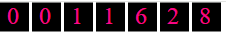
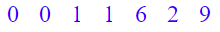

# GitHub Readme Counter

<!-- repository summary badges start -->
<div>
    
    
    
    
    
    
    
    
    
    
    
    
    
    
    
    
    
    
    
    
    
    
</div>
<!-- repository summary badges end -->

This project provides a simple web service that generates a dynamic SVG image showing a visitor count. It increments a counter every time the endpoint is called and returns an SVG image displaying the updated count.

## 🛠️ Requirements to Run the Project

1. [Node.js](https://nodejs.org/en)
2. [Express](https://expressjs.com/)

## 🚀 Instructions

These instructions will get you a copy of the project up and running on your local machine for development and testing purposes.

1. ### Prerequisites

   You need to have Node.js installed on your machine to run this project. You can download and install Node.js from [Node.js official website](https://nodejs.org/).

2. ### Installing

   Follow these steps to get a development env running:

   1. Clone the repository to your local machine:
      ```bash
      git clone https://github.com/montasim/github-readme-counter.git
      ```

   2. Change into the project directory:
      ```bash
      cd github-readme-counter
      ```
   
   3. Install the necessary packages:

      ```bash
      yarn install
      ```
   
   4. Start the server:

      ```bash
      yarn start
      ```
   
      This will start the server on the port specified in your environment variables or default to a system assigned port.

## 🖼️ Using the Service

Once the server is running, you can make a request to the SVG generator endpoint:

   ```bash
   http://localhost:3000/count.svg
   ```



## 🎨 Customization

This service allows you to customize the appearance of the SVG image through URL parameters. This way, you can easily integrate the counter with different styles and themes of your web pages or applications.

### Customizing Colors

The SVG image's background and text colors are customizable through URL parameters. Here are the parameters you can use:

- `backgroundColor`: Specifies the hex code for the background color of the SVG. The default color is black (`000000`).
- `textColor`: Specifies the hex code for the color of the text displaying the count. The default color is magenta (`EB008B`).

#### Example Usage

To change the background color to white (`FFFFFF`) and the text color to blue (`0000FF`), you would access the service using the following URL:

```bash
http://localhost:3000/count.svg?backgroundColor=FFFFFF&textColor=0000FF
```



### Notes on Customization

- Ensure to provide the color codes without the `#` symbol as the service automatically handles it.
- Colors must be provided in hex format.
- Incorrect or unsupported color values might cause the service to revert to default colors.

## 🤝 Contributing

Please read [CONTRIBUTING.md](./CONTRIBUTING.md) for details on our code of conduct, and the process for submitting pull requests to us.

## 📖 Author

<table>
  <tr>
    <td  align=center>
        
        <a href="https://github.com/montasim">
          <br>
            Ｍ♢ＮＴΛＳＩＭ
          </br>
        </a>
    </td>
  </tr>
</table>

## 👥 Contributors

[](https://badges.pufler.dev)

## 📝 License

This project is licensed under the MIT License - see the [LICENSE.md](./LICENSE.md) file for details

## 🙏 Acknowledgments

1. [sagar-viradiya](https://github.com/sagar-viradiya/sagar-viradiya)
2. [pufler.dev/badge-it/](https://pufler.dev/badge-it/)
2. [github-readme-counter](https://github.com/iamskok/github-readme-counter)
