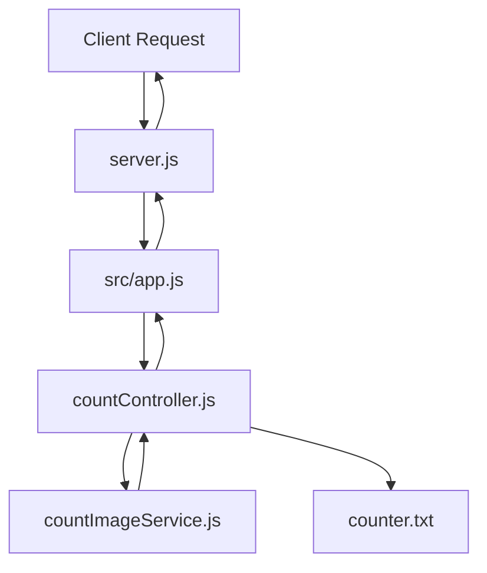
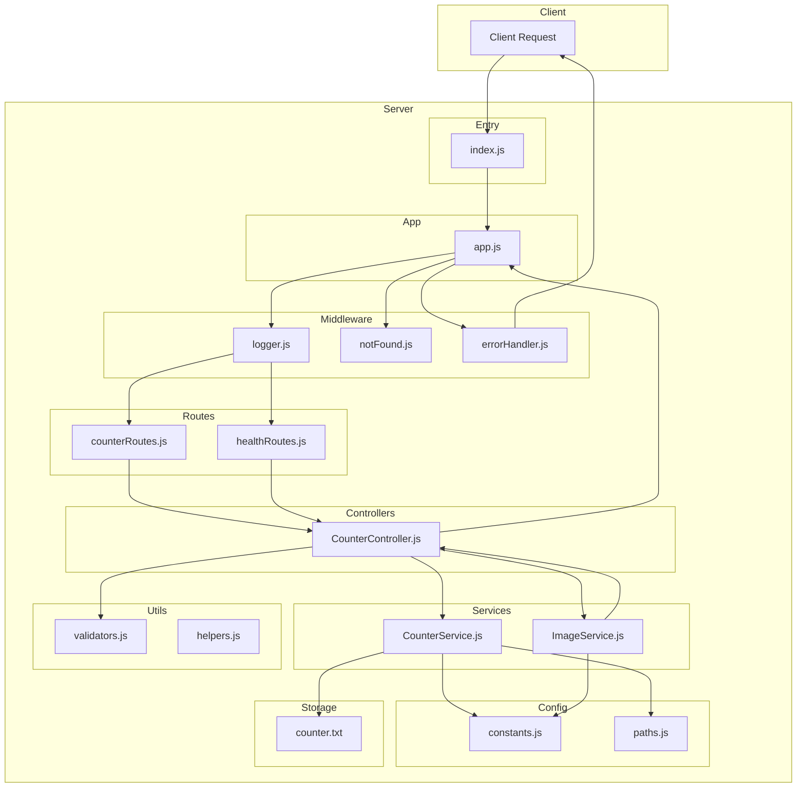
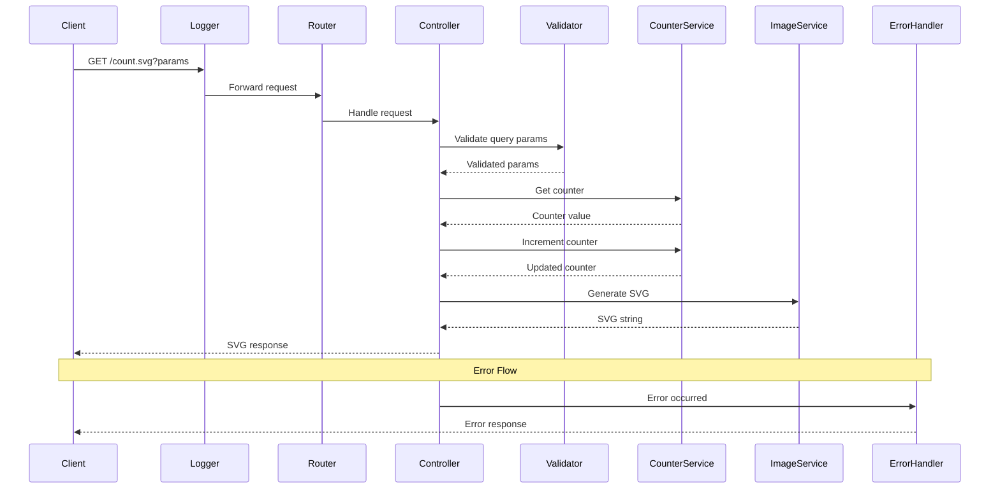

# Architecture Diagram

## Current Architecture



**Issues with Current Architecture:**
- Tight coupling between controller and file system
- No error handling middleware
- No logging
- No separation of concerns
- Direct file operations in controller

---

## Proposed Architecture



---

## Data Flow Diagram



---

## Component Responsibilities

### Entry Point
- **index.js**: Server initialization, graceful shutdown, signal handling

### App Configuration
- **app.js**: Express app setup, middleware registration, route registration

### Middleware Layer
- **logger.js**: Request/response logging
- **notFound.js**: 404 handler for undefined routes
- **errorHandler.js**: Global error handling

### Routes Layer
- **counterRoutes.js**: Counter endpoint routes
- **healthRoutes.js**: Health check endpoint

### Controllers Layer
- **CounterController.js**: Request handling, orchestrates services

### Services Layer
- **CounterService.js**: Counter operations (read, increment, write)
- **ImageService.js**: SVG generation

### Utilities Layer
- **validators.js**: Input validation functions
- **helpers.js**: Helper functions

### Configuration Layer
- **constants.js**: Magic numbers, default values, SVG config
- **paths.js**: Path configurations

---

## SOLID Principles in Architecture

### Single Responsibility Principle (SRP)
Each component has one clear responsibility:
- Logger: only logs requests
- Router: only routes requests
- Controller: only handles request/response
- CounterService: only manages counter
- ImageService: only generates SVG

### Open/Closed Principle (OCP)
- New routes can be added without modifying existing routes
- New storage backends can be added without modifying CounterService interface
- New image formats can be added without modifying existing code

### Liskov Substitution Principle (LSP)
- Services follow consistent interfaces
- Implementations can be swapped without breaking functionality

### Interface Segregation Principle (ISP)
- Small, focused interfaces for each service
- No unnecessary methods

### Dependency Inversion Principle (DIP)
- Controller depends on service abstractions
- Easy to swap implementations (file → database → Redis)
- Easy to mock for testing

---

## Express.js Best Practices in Architecture

### Middleware Chain
```
Request → Logger → Routes → Controllers → Services → Response
                ↓
            NotFound (if no route matched)
                ↓
            ErrorHandler (if error occurred)
```

### Error Handling Flow
```
Error → ErrorHandler → Log Error → Send Error Response
```

### Request Flow
```
1. Logger middleware logs incoming request
2. Router matches route
3. Controller handles request
4. Services perform business logic
5. Response sent back
6. Logger middleware logs response
```

---

## Benefits of New Architecture

### Maintainability
- Clear separation of concerns
- Easy to locate and modify code
- Consistent structure

### Testability
- Each component can be tested in isolation
- Easy to mock dependencies
- Clear interfaces

### Scalability
- Easy to add new features
- Easy to swap implementations
- Modular design

### Reliability
- Proper error handling
- Comprehensive logging
- Input validation

### Code Quality
- Follows industry best practices
- Clean, readable code
- Well-documented
